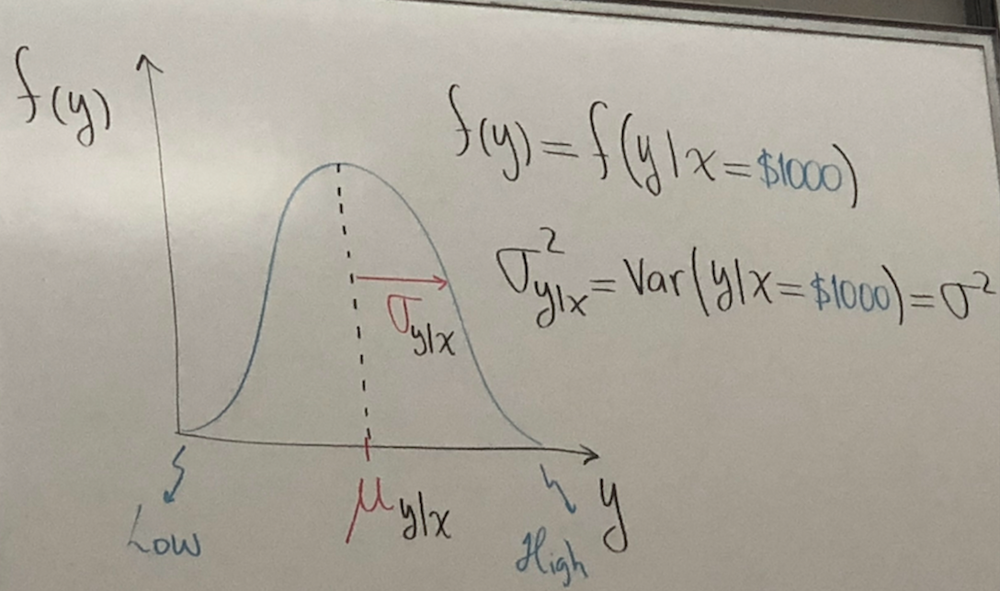
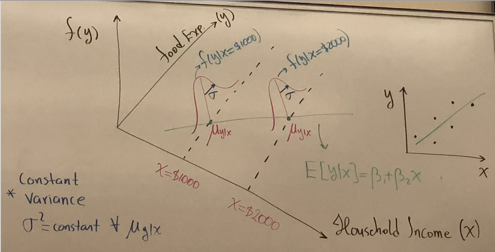
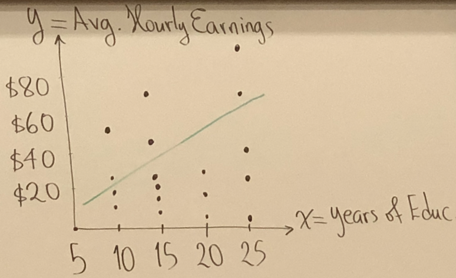
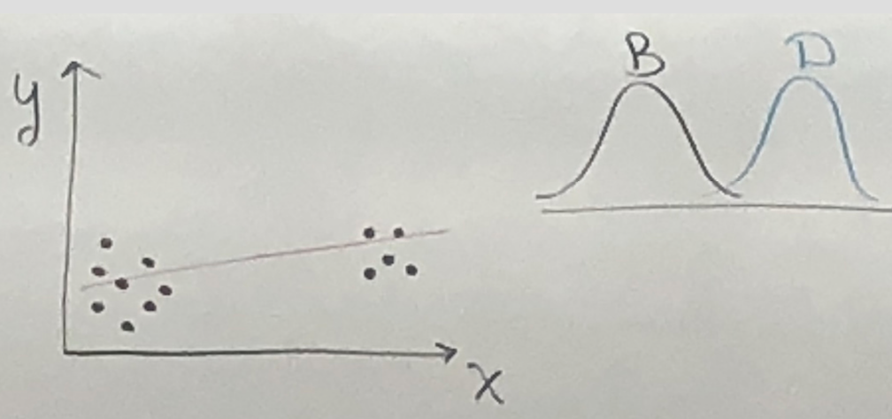
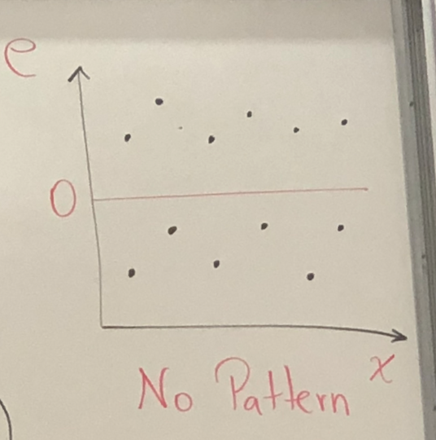
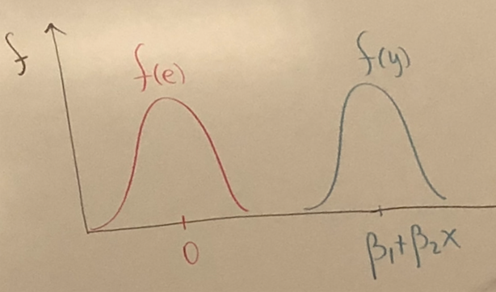
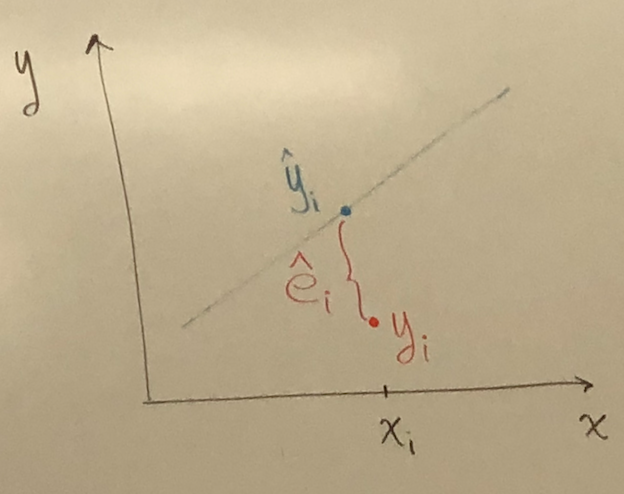
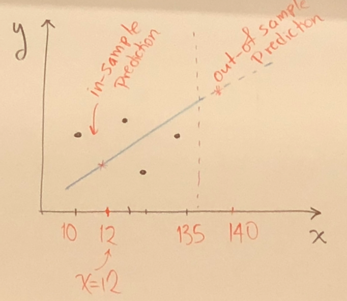
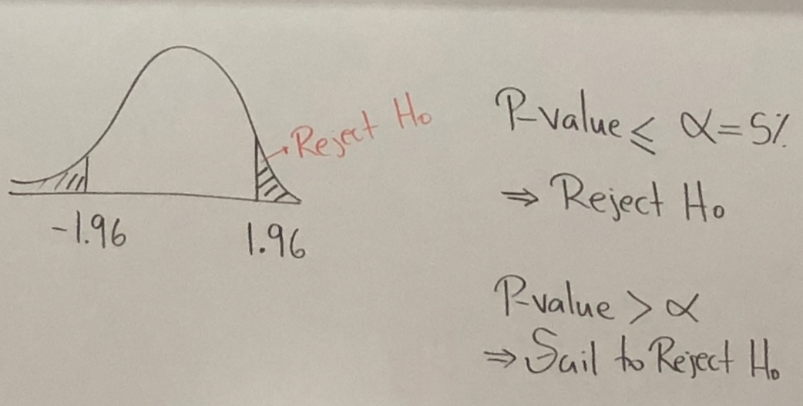

Chapter 2 Linear Regression Model
---
An Economic Model, $x, y$ are random variables:
* $y =$ Dependent/ Explained/ Response var     
$x =$ Independent/ Explanatory/ Predictor var     

* Example: Relation between household income and expenditure on food     
&rarr; $x=$ household, $y=$ food expenditure;     

Assume: Y-Normal Distribution     

1. $μ_{y|x} = E[y|x=$1000]$
2. How about $f(y|x=$2000)$? This can be seen as same variance but shifted towards the new mean $2000.

`NOTE: From f(y) we can get confidence intervals, point estimates and probabilities.`

## Simple linear Regression (SLP) $E[y|x] = μ_{y|x} = β_1 + β_2 x$     

**Parameters of the model:** $β_1 = y-$ intercept, $β_2$ = slope = $\frac{△E[y|x]}{△x} = \frac{d E[y|x]}{d x}$     

If the constant variance assumption holds, the data are said to be **homoskedastic**, otherwise, they are said to be **hetroskedastic**.     

* Scatter Example: X - discrete var, years with gap.     
     

  * $\hat y =-5.38 + 1.76x$;     
y - true data, $\hat y$ - estimated value;     

  * $-5.38$ has no interpretation, because we do not have date for $x=0$. $x=0$ is not realistic for model;     

  * $1.76$ for each additional year of education, we expect hourly wage to increase by $1.76.

### Characteristic     

* $x$ takes at least 2 different values;     

* $x$ values are given and are not random (fixed in repeated samples), `x is not a r.v`     

1. $E[y|x] = β_1 + β_2 x$     

2. $Var(y|x) = σ^2$     

3. $COV(y_i, y_j)=0$      
Independence → $COV(y_i, y_j)=0$, but $COV(y_i, y_j)=0$ ≠ Independence     

Optional $y$ ~ $N(μ_{y|x}, σ^2)$
compare:     

### Error term
Decompose the observation y into 2 components.
1. $E[y|x] = β_1 + β_2 x$ = Systematic components of $y$.     

2. $Error = y -E[y|x] = y - β_1 - β_2 x$ = Random Components
3. Data = Model + Uncertainty, $y = β_1 + β_2 x + error$

#### Error term has expectation of Zero
$Error = y - β_1 - β_2 x$, take expected value on both side:      
$E[e]= E[y - β_1 - β_2 x] = E[y|x] - β_1 - β_2 x = (β_1 + β_2 x) - β_1 - β_2 x = 0$     
`Notes: x is not a r.v.`     
     

$f(y)$ and $f(e)$ have the same variance, $E[e]=0, E[y] = β_1 + β_2 x$     

#### Var(error)= Var(y)
$Var(e)= Var (y - β_1 - β_2 x) = Var(y)$     

### Ordinary Least square, estimate the Model Parameters
Error is the sum of distance between the data points and the Line.      

1. Find the best fit line such that $d_1^2+...+d_n^2$ is a minimum     
2. Result: $\hat y = \hat β_1 - \hat β_2 x = b_1 + b_2 x$, where $\hat e = y_i - \hat y_i =$ LS Residuals     
3. Let SSE(sum square error) = $\sum_{i=0}^{n} \hat e_i^2 = \sum_{i=0}^{n}(y_i- β_1 - β_2 x_i)^2 = S(β_1, β_2)$.
4. Thus, find $β_1, β_2,$ such that $S(β_1, β_2)$ is minimum    
5. Solution(Least Square Estimators), $(x^-, y^-)$ = centroid.

   * $b_1 = y^- - b_2 x^-;$     

   * $b_2 = \frac {\sum_{i=0}^{n}(x_i - x^-)(y_i - y^-)}{\sum_{i=0}^{n}(x_i - x^-)^2}$     

   `Notes: avoid vertical slope, take at least 2 x value. `

### SLP Application and goal to predict
Food expenditure example, $x =$ income in \$100s, $\hat y_i = 83.42 + 10.21x_i$

Interpretation:
1. Slope $= b_2 = 10.21$, if weekly income increases by $10(x=1), we expect food expenditure increase by $10.21;
2. y-intercept $= b_1 = 83.42$, no Interpretation since $x ≠ 0$     

3. Mathematically, $y(x=1000)=83.43 + 10.21(1000)$ is computable, but is $x=1000$ valid?
Let's say Range of x is $[10,135]:$     

### Elasticity     

$e = \frac{\%△y}{\%△x%} = \frac{100 \frac{△y}{y}}{100 \frac{△x}{x}} = \frac{△y}{△x}\frac{x}{y}$, where $\frac{△y}{△x}$ is the slope along a specified curve.

For the linear relationship $β_2 = \frac{△E[y]}{△x}, e = \frac{△E[y]}{△x} \frac{x}{E[y]} = β_2 \frac{x}{E[y]}$     

Error will depend on choice of $x$, $y$ and $E[y]$, thus $\hat E = b_2 \frac{\overline x}{\overline y}$     

* Food & Expenditure Example:     
Known $(\overline x, \overline y) = (19.60, 283.57), b_2 = 10.21$, solve for $\hat E = 10.21 \frac{19.60}{283.57} ≈ 0.7 < 1$, food is inelastic.

### Estimators
* Given a statistic model/parameter $\theta$, and respective estimator $\hat \theta$     

* Bias of the estimator: Bias[$\theta$] = E{$\hat \theta - \theta$} = $E[\hat \theta]$ - $\theta$     
`Notes: Least Square estimators b_1, b_2 of β_1 and β_2 respectively are unbiased.`

  * Unbiased estimator: $E[\hat \theta]$ - $\theta = 0$     

  * biased estimator: $E[\hat \theta]$ - $\theta ≠ 0$     

* Bias $[b_2] = E[b_2 - β_2] = E[β_2 + \sum_{i=1}^{n} w_i e_i - β_2] = \sum_{i=1}^{n} w_i e_i = \sum_{i=1}^{n} E[w_i e_i] = \sum_{i=1}^{n} w_i E[e_i] = \sum_{i=1}^{n} w_i * 0 = 0$     
* $b_2 = \frac{\sum (x_i - \overline x)(y_i - \overline y)}{\sum (x_i - \overline x)^2} = \sum w_i y_i$, where $w_i = \frac{x_i - \overline x}{\sum (x_i - \overline x)^2}$     
`Notes: This applies to estimators, not our estimates.`     

### Gauss Markov Theorem
Assuming SR1-SR5 hold,  $b_1 and \ b_2$ are the best linear unbiased estimators.

### Variance, Covariance and the Least Square estimators
Unbiased estimator of the error term: $\hat σ^2 = \frac{\sum\hat σe^2 }{N-2}$     

$\hat Var(b_2) = \frac{\hat σ^2}{\sum (x_i - x^-)^2} = se(b_2) = \hat Var(b_2)^\frac{1}{2}$     

$\hat Var(b_1) =  \hat σ^2\frac{x^2}{N \sum (x_i - x^-)^2} = se(b_2) = \hat Var(b_2)^\frac{1}{2}$     

$Cov(b_1, b_2) = \hat σ^2\frac/-x^-{\sum (x_i - x^-)^2) }$

## Non linearities in Simple Regression
### Log -Linear function, $log(y)= β_1+ β_2 x$     
* easier to solve: income ~ $[10^3, 10^9]$, Log[income] ~[3,9];     

$log(y_1) = β_1+ β_2x_1 + e, ~log(y_2) = β_1+ β_2x_1 + e, ~△log(y) = β_2 △x$     

$100△log(y)= 100 β_2 △x=\% △$

* Example:      
  * $los(wage)= β_1+ β_2 educ +e$,  &rarr; $\hat {log(wage)} = 0.584+ 0.083 educ$    

  * $\% △ y =100 β_2 △x = 100(0.083)(△x-1)= 8.3\%$     
	for every additional year of education, we expect wages to increase by 8.3%.   

### Quadratic Function,$y = β_1+ β_2 x + β_3 x^2$    
`Notes: β_1 > 0, and β_3 < 0, diminishing marginal effect`
* Slope = $\frac{dy}{dx} = β_2 + 2 β_3 x = 0, ~~~~~~~~~~~~~x^* = \frac{-β_2}{2β_3}$     

* Example: $\hat {wage} = 5.25 + 0.48 exper - 0.08 exper^2$     

  * $slope = \frac{-β_2}{2β_3} = exper^* = \frac{-0.48}{2*(-0.08)} = 3$     

  * Interpretation: experience has a positive effect on wages up to the turning point at 3 years.

## Regression with indicator variables, Dummy variable:
$$L = \left\{
        \begin{array}{11}
            1, &\mbox{if the characteristic is present} \\
            0, &\mbox{if the characteristic is absent} \\
        \end{array}
    \right.
		$$

### Interpretation:
$\hat {wage} = 7.10 -2.51~F, ~~R^2 = 0.12$, Standard error to $β_1$ and $β_2$ are $0.21$ and $0.3$ respectively, total numbers of observation is 526, $n_w = 274, n_m = 252$, and
$$F = \left\{
        \begin{array}{11}
            1, &\mbox{Female} \\
            0, &\mbox{Male} \\
        \end{array}
    \right.
		$$    

1. $F=0=$ Male $= 7.10$ = y-intercept = Avg. hourly wages for men;     
$F=1=$ Female $= 7.10 = \hat {wage}(F=1) = 7.1-2/51=4.59$ = Avg. hourly wages for women;     

2. Is the hourly wage difference between men and women statistically significant?    
Yes. $\hat {wage}(F=1) - \hat {wage}(F=0) = 4.59-7.10=-2.51$, reject 0, $E = \frac{-2.51}{0.3}= -8.37$     

     
