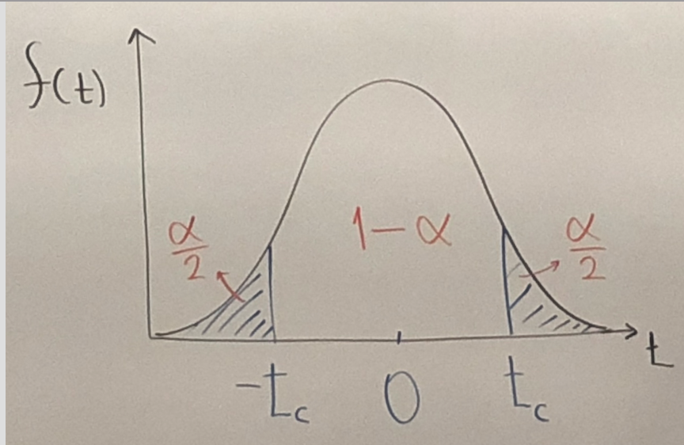
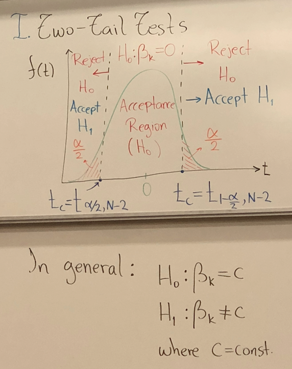
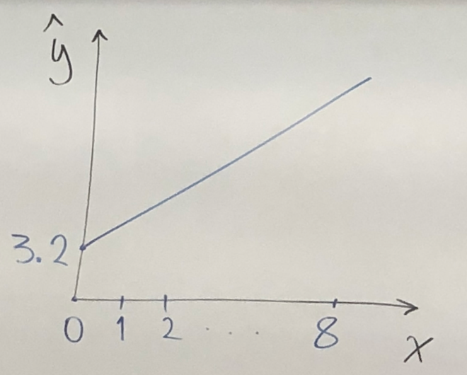

Chapter 3, Interval Estimation and Hypothesis Testing     
---

* Objective: point estimate &rarr; confidence intervals &rarr; prob distribution     

* Need: Parameters, means, standard errors.     

Recall that $\hat σ^2 = \frac{\sum\hat σe^2 }{N-2}$ is not normally distributed, more consistent with a t-distribution.     

Test statistic $=t=\frac{b_k - β_k}{se(b_k)}$ ~ $t_{N-2}$, for $k=1,2~$ &rarr;$t_c = t-critical = t_{1-\frac{\alpha}{2}, N-2}$      

$P(-t_c ≤ t ≤ t_c) = 1-\alpha$, &rarr;$P(-t_c ≤ \frac{b_k - β_k}{se(b_k)}t ≤ t_c) = 1-\alpha$ &rarr;$P(b_k - t_c se(b_k) ≤ b_k ≤ b_k + t_c se(b_k)) = 1-\alpha$        

## The Interval estimator of $β_k$
`Def:` $b_k ± t_c se(b_k)$, where the interval has a probability $1-α$ of containing the true but unknown parameter $β_k$

* Example:     
$N=40, α=0.05, b_2 = 10.21, se(b_2)=2.093$      
$CI(β_2)= b_2 ± t_c se(b_2),~$ &rarr; $t_c = t_{1- \frac{α}{2}, N-2} = t_{0.975, 38} = 2.024$       
&rarr; (95%:) $CI(β_2)= 10.21 ± 2.024(2.093)= [\$5.97, \$14.45]$     

* Interpretation: We estimate with 95% confidence, that from an additional \$100 of weekly income, household food expenditure are expected to increase between \$5.97 and \$14.45

## Hypothesis Tests     

1. Determine $H_0$ and $H_1$;

2. Test statistic and distribution;     

3. Select $α$, and determine the regression region;     

4. Compute the test statistic from the sample;     

5. Compute the p-value, probability value of the test;     

6. Conclusion:
$$P-value \left\{
    \begin{array}{11}
        Low, &\mbox{P-value < $α$, Reject $H_0$} \\
        High, &\mbox{P-value ≥ $α$, Fail to reject $H_0$} \\
    \end{array}
  \right.
$$    

### Two Tile Test(Default)     

            

### Linear Combination of Parameters     

$H_0: c_1 \beta_1 + c_2 \beta_2 = c_0, ~c_0, c_1,c_2$ are constants;     

$H_1: c_1 \beta_1 + c_2 \beta_2 ≠ c_0$(two tile), $~c_1 \beta_1 + c_2 \beta_2 ＞(or)＜ c_0$(one tile);     

$se(c_1 b_1 + c_2 b_2) = \sqrt{c_1^2Var(b_1)+ c_2^2Var(b_2) + 2 c_1 c_2 cov(b_1, b_2)}$, &rarr; $t=\frac{c_1 b_1 + c_2 b_2 - c_0}{se(c_1 b_1 + c_2 b_2)}$ ~ $t_{N-2}$     

`Notes:` very useful when computing $E[y|x=x_0] = \beta_1 + \beta_2 x_0$     

#### Example of Food Expenditure $\hat y = 83.416 + 10.2096x$     
Find $\hat y(x=20)$ and $~CI_{95\%}$ $\hat y(x=20)$       

Let $\hat λ = c_1 b_1 + c_2 b_2 = 1*83.4 + 20*10.21 = \$287.61$     
$CI_{95\%} \hat y(x=20)= \hat λ ± se(\hat λ)= [\$258.9, \$316.3]$     

#### Exercise 3.2
Known: $n=24$ artists, $y$ = quality rating = RATING[=1(poor), =7(excellent)], $x=$ work experience = EXPER[years], $\hat {RATING} = 3.204+0.076EXPER$     
$se = 0.709, 0.044$     

##### a. Sketch and interpret slope:  
   
       

Interpretation: on average, a technical artist's quality rating is expected to increase by 0.076 for every additional yer of experience

##### b. Find $CI_{95\%}(\beta_2)$      
In what are you 95% confident? See p743 Table 2, $\alpha = 5\%, ~±t_{1- \frac{α}{2}, N-2} = t_{0.975, 22} = 2.074$     

$b_2 =0.0076, se(b_2) = 0.044$     

&rarr; $CI_{95\%}(\beta_2) = b_2± t_c se(b_2) = 0.076 ± 2.074*(0.044) = [-0.015, 0.167]$(not stat. significant)    

Interpretation: We are 95% confident that the method we used to compute the CI, will yield an interval that contains the true parameter $\beta_2$.     

##### c. Test $H_0:\beta_2=0, ~ H_1:\beta_2≠0$(2-tail-test)     
use $\alpha = 5\%$     

$t_{stat}=\frac{b_2}{se(b_2)} = \frac{0.076}{0.044}=1.727$     
$t_c = 2.074$     
&rarr; $-2.074 (rejection)< t_{stat}=1.727 < 2.074(rejection)$     
&rarr; faill to reject $H_0, b_2$ is not stat sign.     

##### d. Test $H_0: \beta_2=0, ~ H_1:\beta_2>0$(right-tile-test)     
use $\alpha = 5\%$

$t_{stat}=\frac{b_2}{se(b_2)} = \frac{0.076}{0.044}=1.727$     

$t_c = t_{1- \frac{α}{2}, N-2} = t_{0.95, 22} = 1.717$       

Since $t_{stat} > t_c$, reject $H_0$,     

&rarr; Experience has a positive effect on quality rating.     

##### e. Given that for c):     
the p-value$=0.0982,$ if P(type I Error = $\alpha$)= $5\%$, do we reject or not $H_0?$     
&rarr; p-value $> \alpha$ &rarr; Fail toe tejrct $H_0.$     

### Linear Combination Application    

Let $\lambda = f (\beta_1, \beta_2), f$ is a linear function.     

&rarr; $t_{stat} = \frac{\hat \lambda - \lambda}{se(\hat \lambda)}$     

`Special case`     
$f (\beta_1, \beta_2) = \beta_1 + \beta_2 x$, &rarr; $\hat \lambda= b_1 + b_2 x = c_1 b_1 + c_2 b_2$(general linear Combination)    

&rarr; $t_{stat} = \frac{(c_1 b_1 + c_2 b_2) - (c_1 \beta_1 + c_2 \beta_2)}{se(c_1 b_1 + c_2 b_2)}$, &rarr; $~CI(\lambda) = \hat \lambda ± t_c se(\hat \lambda)$     

#### Food expenditure Example     
$\hat y = 83.41 + 10.21x$,      
&rarr; $\hat y(x=20) =c_1 b_1 + c_2 b_2 = (1)(83.41) + (20)(10.21) = 287.61 = \hat \lambda$     

Known: $se(b_1) = 43.4, se(b_2) = 2.09, \hat {COV(b_1, b_2)} = -85.9$

##### a. Find $CI_{95\%}(\lambda)$:     

$se(\hat \lambda) = \sqrt{c_1^2 VAR(b_1)+c_2^2 VAR(b_2) + 2c_1 c_2 COV(b_1, b_2)} = \sqrt{(1)^2(43.4)^2+(20)^2(2.09)^2 + 2(1)(20)(-85.9)} = 14.78$     

&rarr; $t_{stat} = \frac{287.61 - 0}{14.78} = 19.45$     

&rarr; $t_c = t_{0.975, 38}= 2.02$     

&rarr; $CI_{95\%}(\lambda) = 287.61 ± 2.02(14.78) = [\$258.9, \$316.3]$     

##### b. Test: $H_0:\lambda = \$300, ~H_1: \lambda ≠ \$300$     
$t_{stat} = \frac{\hat \lambda - \lambda}{se(\hat \lambda)} = \frac{287.61-300}{14.78} = -0.879$     

&rarr; $t_c = ± 2.02$     
&rarr; $t_c = -2.02 (rejection) < t_{stat}=-0.879 (acceptance)$     
&rarr; fail to reject $H_0$     

`Midterm on Feb 1st will include Chapter 1-3.`
