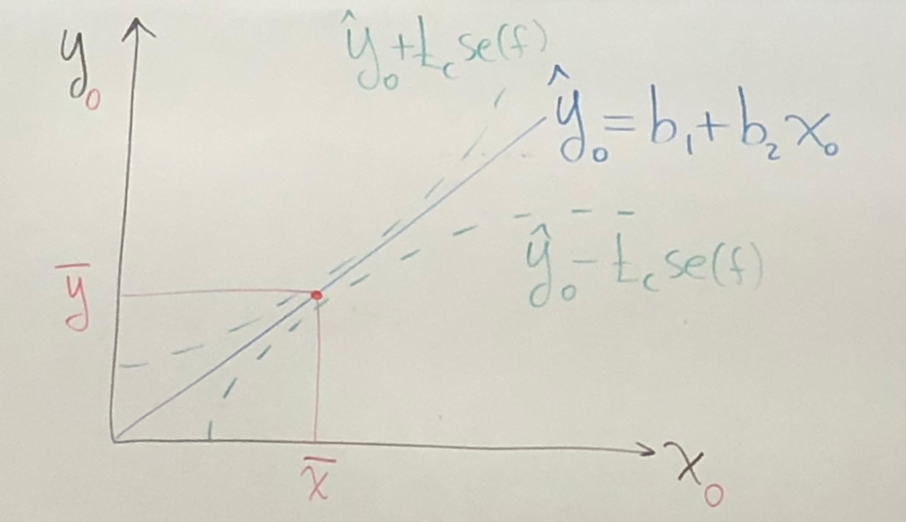
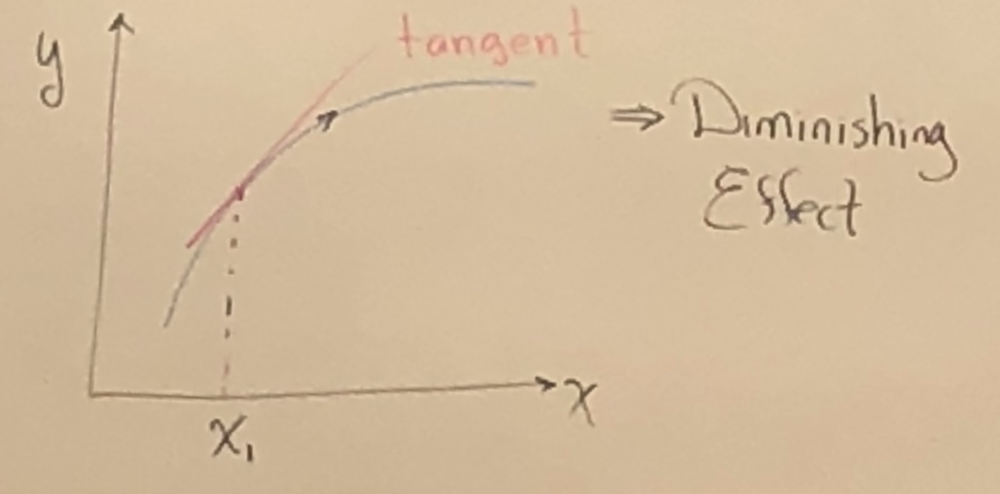
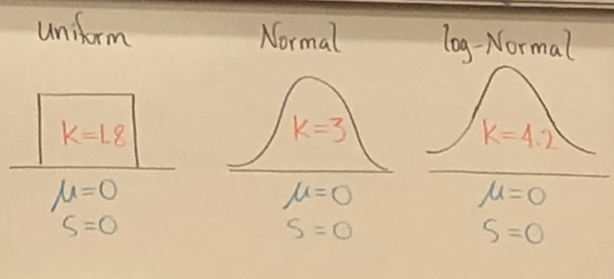
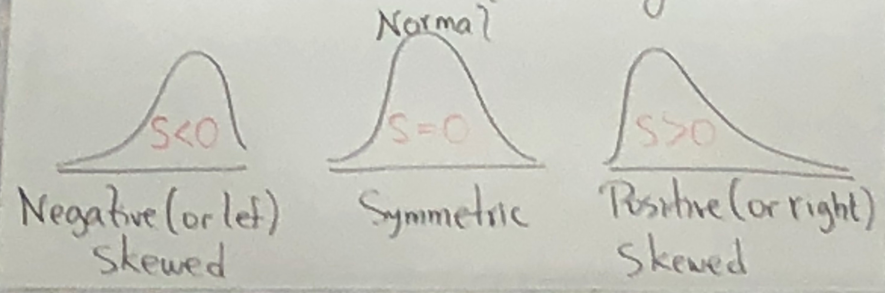
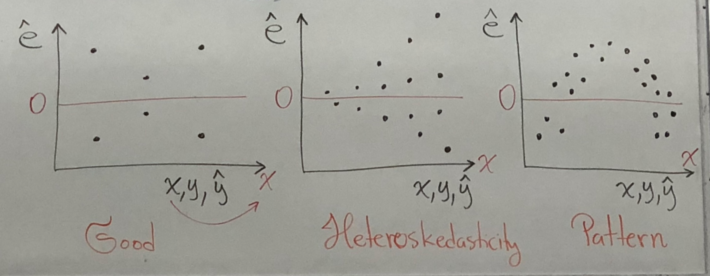
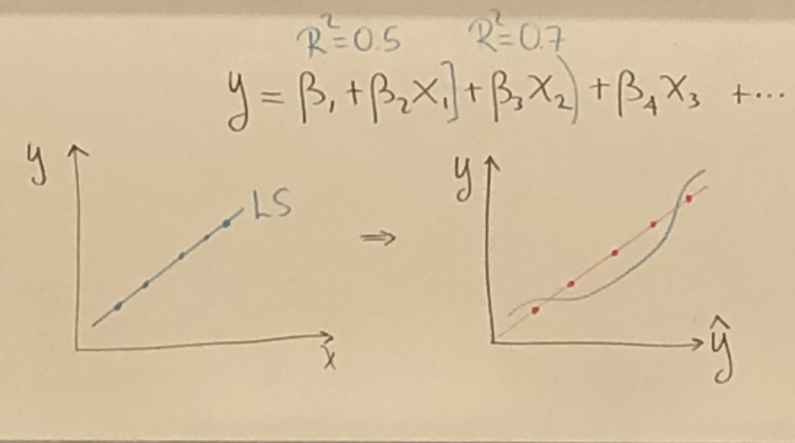

Chapter 4: Prediction, Goodness of Fit and Modeling Issues
---

## Least Square Prediction: predict $y=y_0$ given an $x_0$     

Known: $y_0 = \beta_1 + \beta_2 x_0 + e_0, ~E[y_0] = \beta_1 + \beta_2 x_0, E[e_0] = 0, Var(e_0) = \sigma ^2$     

Predict $y_0$: $~\hat y_0 = b_1 + b_2 x_0$      

Estimate: $E[y_0] = \beta_1 + \beta_2 x_0, ~\hat {E[y_0]} =  b_1 + b_2 x_0 = \hat y_0$      

`Def:` Forecast $Error = f = y - \hat y_0 = (\beta_1 + \beta_2 x_0 + e_0) - (b_1 + b_2 x_0)$, &rarr; $E[f] = \beta_1 + \beta_2 x_0 - (b_1 + b_2 x_0) = 0$     

&rarr; $\hat y_0$ is an unbiased predictor of $y_0$, the best linear Unbiased predictor(BLUP) of $y_0$ if SR1-SR5 hold.      

&rarr; $Var(f) = \sigma ^2[1 + \frac{1}{N} + \frac{(x_0 - \overline x)^2}{\sum (x_i - \overline x)^2}]$     

$\sigma_f ^2$ ↓ as $N$ ↑, $\sigma_f ^2$ ↑ as $(x_0 - \overline x)^2$ → $0$     

Since we don't know $\sigma^2$, we use $\hat \sigma^2, \hat {Var[f]} = \sigma^2 + \frac{\sigma^2}{N} + (x_0 - \overline x)^2 Var(b_2)$     

`Def:` standard error of the Forecast $se(f)=\sqrt {\hat {Var(f)}}$     

`Def:` Predictor Interval $\hat y_0 ± t_c * se(f)$     

     

## Goodness of Fit, use $x_i$ to explain the variation in $y_i$     

$$y_i = \beta_1 + \beta_2 x_i + e_i \left\{
    \begin{array}{11}
        \beta_1 + \beta_2 x_i= E[y_i], &\mbox{Explainable, Systematic} \\
        e_i, &\mbox{unexplainable, Random/Unsystematic} \\
    \end{array}
  \right.
$$     

In practice, we estimate $\beta_1, \beta_2$ with $\hat y_i = b_1 + b_2 x_i$     

$\hat e_i = y_i- \hat y_i~$ &rarr; $~y_i = \hat y_i + e_i, S_y^2 = \frac{\sum (y_i - \overline y)^2}{N-1}~$ &rarr; $~y_i - \overline y = y_i + \hat y_i + \hat e_i$     

&rarr; $(y_i - \overline y)^2 = [\hat y_i - \overline y + \hat e_i]^2$ &rarr; $\sum (y_i - \overline y)^2 = \sum (\hat y_i - \overline y)^2 + \sum \hat e_i^2$     

$SST$ = Total sum of squares = $\sum (y_i - \overline y)^2$     

$SSR$ = Sum of squares due to regression = $\sum (\hat y_i - \overline y)^2$     

$SSE$ = Sum of squares due to Error = $\sum \hat e_i^2$     

$SST=SSR+SSE$     

### Coefficient of Determination = $R^2$     

$R^2 = \frac{SSR}{SST} = 1- \frac{SSE}{SST}, 0 ≤ R^2 ≤ 1$     

$R^2 =$ proportion of variance explained in $y$ by the regression.     

### Corrlation Coefficient $\rho$     
$\rho= \frac{Cov(x, y)}{\sqrt{x} \sqrt {y}}$, $-1 ≤ \rho ≤ 1$     

#### Estimate     
$r = \frac{S_{xy}}{S_x S_y}, S_{xy}=$ sample Cov $(x,y)$     

* r measures the strength of the linear association between $x$ and $y$     

* $S_x^2 = \frac{\sum (x_i - \overline x)^2}{N-1}, S_y^2 = \frac{\sum (y_i - \overline y)^2}{N-1}, S_{xy} = \frac{\sum (x_i - \overline x)^2 (y_i - \overline y)^2}{N-1}$     

## Modeling Issues     

### Scaling Data:     

Model: $y_i = \beta_1 + \beta_2 x + e$, c is constant;     

* only for linear model.     

Transformation | Slope |Intercept | $R^2$ | t_{stat}
---|---|---|---|---|
$y$ &rarr; $y/c$ | $\beta_2/c$ | $\beta_1/c$ |same |same     
$x$ &rarr; $x/c$ | $c~\beta_2$ | - | same | same |     

### Marginal Effect     

     

* tangent line is flatting out.     

`Notes:` $~ln (x + △x) - ln(x) ≈ \frac{△x}{x}$, when $\frac{△x}{x}$ is small.     

### Nonlinear Transformation     

#### Linear Log Model $y_i = \beta_1 + \beta_2 ln(x) + e, ~ x>0$     

* Slope $=\frac {\beta_2}{x}$, Elasticity $=\frac {\beta_2}{y}$     

* Slope Interpretation: $△y ≈ \frac{\beta_2}{100}(\%△x)$     
$1\%$ change in $x$ is associated with a change in $y$ of $0.01~\beta_2$      

##### Example: Test Score and District Income [in \$1,000]     

Known: $\hat {TestScore} = 557.8 + 36.42~ln[Income]$, std error $3.8, 1.4$ respectively, $R^2 = 0.56$     

1. Slope Interpretation     
Slope: $1\%$ increase in Income is associated with a increase in test scores of $0.01 × 36.42 = 0.36$ points.     

2. Predicted Difference in test scores foe districts with average incomes of \$10,000 Vs. \$11,000, and \$40,000 Vs. \$41,000
&rarr; $△ \hat y = [557.8 + 36.42 ln (11)] - [557.8 + 36.42 ln (10)] = \$3.47$     
`Note:` For $\$40k$ vs. $\$41k$  &rarr; $△ \hat y = 0.9$     

#### Log Linear Model $ln(y) = \beta_1 + \beta_2 x, y>0$     

* Slope $y \beta_2$, Elasticity $x \beta_2$     

* Slope Interpretation: $\frac{△y}{y} ≈ \beta_2 △x$     
1 unit change in $x$ is associated with a $100\beta_2\%$ change in $y$, or $\%△y = (100 ~\beta_2)△x$     

##### Example Earnings Vs. Age     

Known: Ln(Earnings) $=2.805 + 0.0087 Age$, std error $0.018, 0.0004$ respectively, $R^2 = 0.027$     

1.  Slope interpretation     
Earnings are predicted to increase by $0.87\% (100 × 0.0087)$ for each additional year of age.     

#### Log Log $ln(y)= \beta_1 + \beta_2 ln(x), x>0, y>0$    

* Slope: $\beta_2(\frac{y}{x})$, Elasticity: $\beta_2$     

* Slope interpretation: $\beta_2 = \frac{△y/y}{△x/x}=$ Elasticity with respect to $x$.     
if the percentage change in $x$ is 1% (△x = 0.01x), then $\beta_2$ is the respective percentage change in $y$.     

##### Example District Income vs. Test scores     

$ln~ \hat {TestScores} = 6.336 + 0.0554~ln~(Income)$, $R^2 = 0.56$, with std error of $\beta_1$ and $\beta_2$ is $0.006,0.0021$ respectively.     

1. Slope Interpretation: A $1\%$ increase in income is estimated to correspond to a $0.0554\%$ increase in Test Scores.      

2. Prediction:     

`special case`: Log-Linear Model     

$ln~(\hat y) = b_1+ b_2x$ &rarr; $\hat y = e$     
$\hat y_c = e^{b_1+b_2x+\frac{\hat {\sigma^2}}{2}} =e^{b_1+b_2x} × e{\frac{\hat {\sigma^2}}{2}} = \hat y_N ×  e{\frac{\hat {\sigma^2}}{2}}$, Since $\hat {\sigma^2} > 0$, &rarr; $~y_c >y_N$     

$100(1-\alpha)\%$ prediction interval for $y = e^{ln(y)± t_c × se(f)}$     

`Note:`     
Source of $e{\frac{\hat {\sigma^2}}{2}}$, Let $z=e^y,~y=ln(z)$ ~$N(μ, \sigma ^2)$, &rarr; $E[z] = e^{μ+\frac{\sigma^2}{2}}$, where $ln(z) = y = \beta_1+\beta_2 x + e$     

`DEF`: Generalized $R^2$      
Recall $R^2 = [corr(y,\hat y)]^2, R_y^2=[corr(y, \hat y_c)]^2$      

## Jarque Bera Test     

Test for normally inputs are the skewness and kurtosis, Test performed on the residuals.      

$JB = {N}{6}(S^2 + \frac{(k-3)^2}{4}),$ where kurtosis $k=3$ and skewness $s=0$, &rarr; Normal distribution $JB=0$.      

$H_0: JB = 0, H_1: JB ≠ 0, JB$ ~ $x^2_{v=2}$      

### Review:      

1. Kurtosis measures peakedness(or flatness);      
    

2. Skewness measures symmetry;      
       

* S< -1 or S>1 Highly Skewed;      

* -1 < S < $\frac {-1}{2}$ OR $\frac {-1}{2}$ < S<1 Moderately Skewed;     

* $\frac {-1}{2}$ < S < $\frac {1}{2}$ Approx Symmetric.     

## Residual Plots      

     

     
